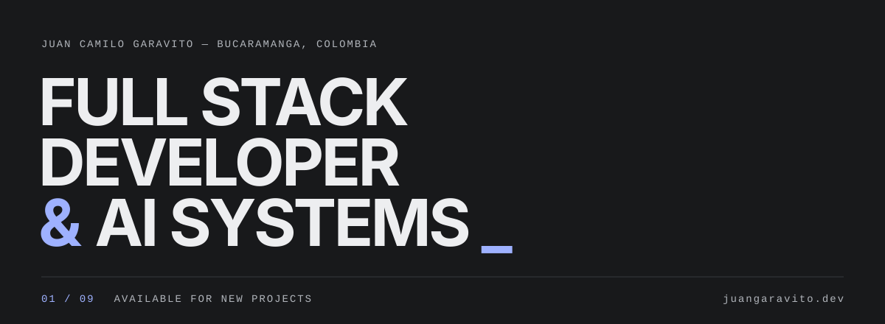

  
  
  
  

 

## Hi, I'm Juan Camilo 👋

### I build products end to end: frontend, backend, database and deployment.

Angular and React on the front. Laravel, Spring Boot and Node.js on the back. Lately, AI agents with LangGraph and vision LLMs that solve real problems in the company — not demos.

TDD, Scrum and Git Flow are the method. AI is the tool.

In my free time I make video games and I play with AI agents (yes, I already played a game against one that I built).

 

## `01` &nbsp;Now

### 🛠️ Building
An agent to manage and recommend recipes, and my first mobile game written in C with Raylib.

### 📚 Studying
MSc in Software Engineering, Universidad de los Andes.

### 🧪 Experimenting
Games in C, and different ways of developing with AI in the loop.

 

## `02` &nbsp;Stack

### Frontend

  
  
  
  

### Backend

  
  
  
  

### AI & Agents

  
  
  

### Data & Infra

  
  
  
  
  

 

  <code>BUCARAMANGA, COLOMBIA</code> &nbsp;—&nbsp; <a href="https://juangaravito.dev"><b>juangaravito.dev</b></a>

